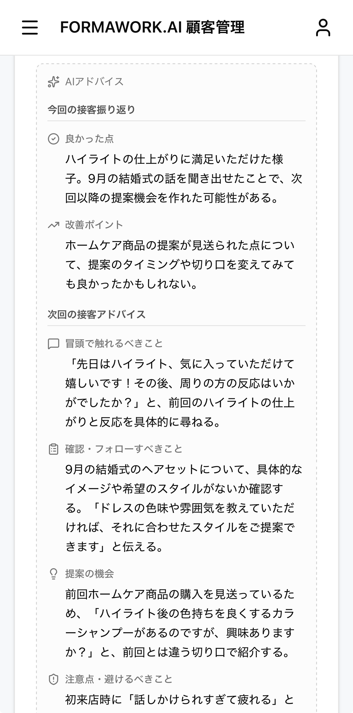
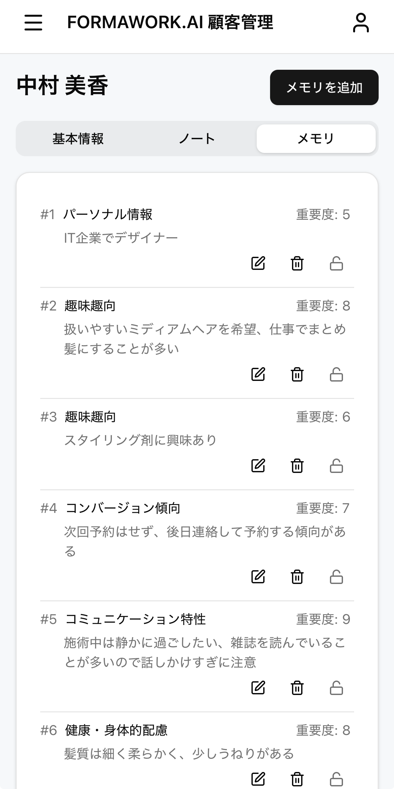

# Formawork AI


AI を活用した顧客管理システムのポートフォリオプロジェクトです。

## Demo

**[https://formawork-ai-web.vercel.app/lp](https://formawork-ai-web.vercel.app/lp)**

「無料でデモを体験する」→「ログイン」で管理者としてデモを体験することができます。  
(一部機能に制限があります。)

## About

このプロジェクトは、最新の Web 技術と AI を組み合わせた顧客管理システムです。
実務を想定した設計で構築しています。

### 主な特徴

- Next.js 16 App Router + React 19 による最新のフルスタック開発
- AI SDK を活用した顧客メモリの自動生成とアドバイス機能
- Google Testing Blog 準拠の包括的なテスト戦略
- CI/CD による自動化と Claude Code による AI コードレビュー

## Screenshots

### AI アドバイス機能

顧客ノートの内容を分析し、次回の接客に活かせるアドバイスを AI が自動生成します。



### AI メモリ機能

顧客とのやり取りから重要な情報を AI が自動抽出し、顧客メモリとして蓄積します。



## Tech Stack

| カテゴリ | 技術 |
|---------|------|
| フレームワーク | Next.js 16.1 (App Router), React 19.2 |
| 言語 | TypeScript 5.9 |
| スタイリング | Tailwind CSS 4, shadcn/ui |
| データベース | PostgreSQL (Supabase), Drizzle ORM |
| フォーム | react-hook-form, valibot |
| テスト | Vitest (Browser Mode), Playwright |
| CI/CD | GitHub Actions, Vercel |
| AI | AI SDK (Vercel) |
| ロギング | pino |
| パッケージ管理 | pnpm (Catalog Mode) |

## Architecture

### モノレポ構成

pnpm workspaces を使用したモノレポで、以下のパッケージで構成されています。

| パッケージ | 説明 |
|-----------|------|
| `apps/web` | Next.js Web アプリケーション |
| `packages/db` | Drizzle ORM スキーマとクライアント |
| `packages/ui` | shadcn/ui ベースの共通コンポーネント |
| `packages/logger` | pino ベースのロギングライブラリ |
| `packages/supabase` | Supabase 設定と認証クライアント |
| `packages/tsconfig` | 共通 TypeScript 設定 |

### 設計思想

- **Server Component First**: データ取得は Server Component で実行し、クライアントバンドルを最小化
- **Container/Presenter パターン**: データ取得ロジックと表示を分離し、テスト容易性を確保
- **フィーチャーベースディレクトリ**: 機能ごとにコードを整理し、関心の分離を実現
- **型安全な Server Action**: valibot によるバリデーションと認証・認可の自動チェック

### ディレクトリ構造

```
.
├── apps/
│   └── web/                    # Next.js Web アプリケーション
│       ├── app/                # App Router ルート
│       │   ├── (private)/      # 認証が必要なルート
│       │   └── (public)/       # 公開ルート
│       ├── features/           # 機能別モジュール
│       │   ├── auth/           # 認証機能
│       │   ├── customer/       # 顧客管理
│       │   ├── customer-note/  # 顧客ノート
│       │   ├── customer-memory/# 顧客メモリ（AI 生成）
│       │   └── staff/          # スタッフ管理
│       ├── components/         # 共通コンポーネント
│       ├── libs/               # ユーティリティ
│       └── e2e/                # E2E テスト
└── packages/
    ├── db/                     # データベース関連
    ├── ui/                     # UI コンポーネント
    ├── logger/                 # ロギング
    └── supabase/               # Supabase 設定
```

## Code Quality

### テスト戦略

Google Testing Blog に準拠した 3 段階のテストサイズ分類を採用しています。

| サイズ | ファイル名 | 説明 |
|--------|-----------|------|
| Small | `*.small.server.test.ts` | 外部依存なしのユニットテスト |
| Medium | `*.medium.server.test.ts` | ローカル DB を使用した統合テスト |
| Large | `*.e2e.test.ts` | Playwright によるE2Eテスト |
| Browser | `*.browser.test.tsx` | Vitest Browser Mode によるコンポーネントテスト |

### 静的解析

| ツール | 用途 |
|--------|------|
| Biome | Lint / Format |
| Knip | デッドコード検出 |
| cspell | スペルチェック |
| TypeScript | 型チェック |

### CI/CD

GitHub Actions で以下のパイプラインを自動実行しています。

- **静的解析**: Lint、Format、型チェック、スペルチェック
- **ブラウザテスト**: Vitest Browser Mode
- **サーバーテスト**: Vitest (Node)
- **E2E テスト**: Playwright
- **Claude Code Review**: AI による自動コードレビュー
- **自動デプロイ**: Vercel

## Features

- **認証**: Supabase Auth によるメール/パスワード認証
- **顧客管理**: 顧客情報の CRUD、検索、ページネーション
- **スタッフ管理**: スタッフ情報の管理、権限設定
- **顧客ノート**: 接客記録の管理、画像添付対応
- **AI メモリ**: 顧客情報の自動抽出・蓄積
- **AI アドバイス**: 接客アドバイスの自動生成

## Getting Started

### 必要な環境

- Node.js 22.x
- pnpm 10.x
- Docker (Supabase ローカル用)

### セットアップ

```bash
# 依存関係のインストール
pnpm install

# 環境変数の設定
cp apps/web/.env.sample apps/web/.env
cp packages/db/.env.sample packages/db/.env
cp packages/supabase/.env.sample packages/supabase/.env

apps/web/.env の AI_GATEWAY_API_KEY を設定する必要があります。 Vercel もしくは Gemini の API KEY を発行して設定してください

# Supabase の起動（初回のみ）
pnpm -w supabase:start

# Supabase の起動（初回のみ）
pnpm -w supabase:seed

# データベースのセットアップ
pnpm -w db:reset

# 開発サーバーの起動
pnpm -w dev
```

### 利用可能なコマンド

```bash
# 開発
pnpm -w dev             # 開発サーバー起動
pnpm -w build           # 本番ビルド

# テスト
pnpm -w test:browser    # ブラウザテスト
pnpm -w test:server     # サーバーテスト
pnpm -w test:e2e        # E2E テスト

# バリデーション
pnpm -w validate:check  # lint, format, 型チェック, スペルチェック
pnpm -w validate:fix    # 自動修正
```
