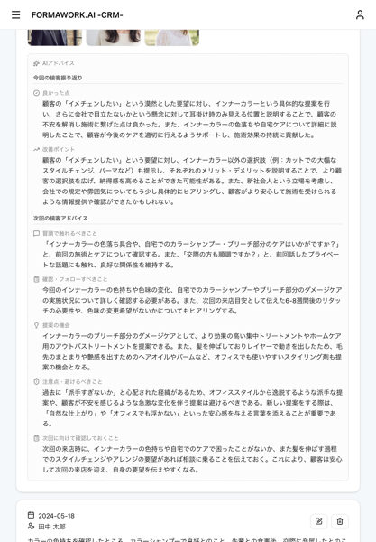
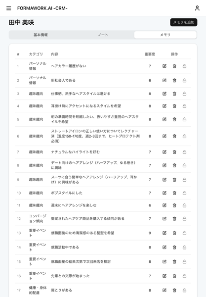

# Formawork AI

AI を活用した顧客管理システムのポートフォリオプロジェクトです。

## デモ

**[https://formawork-ai-web.vercel.app/lp](https://formawork-ai-web.vercel.app/lp)**

「無料でデモを体験する」→「ログイン」で管理者としてデモを体験できます。(一部機能に制限があります)

## スクリーンショット

<table>
  <tr>
    <td align="center"><strong>顧客ノート</strong></td>
    <td align="center"><strong>AI アドバイス機能</strong></td>
    <td align="center"><strong>AI メモリ機能</strong></td>
  </tr>
  <tr>
    <td></td>
    <td></td>
    <td></td>
  </tr>
  <tr>
    <td>接客記録と画像を保存</td>
    <td>顧客ノートを分析し、接客アドバイスを生成</td>
    <td>重要情報を AI が抽出・カテゴリ分類</td>
  </tr>
</table>

## 解決する課題（想定）

### 1. データ共有の問題

顧客情報が Excel や紙で管理されており、スタッフ間でリアルタイムに共有できない。また「どれが最新か」が分からず、古い情報で接客してしまうリスクがある。

→ クラウドベースの顧客管理で、常に最新データを全スタッフが参照可能に

### 2. AI 活用のハードル

AI を業務に活かしたいが、専用の操作を覚える必要があり、IT リテラシーが低いスタッフには導入が難しい。

→ 通常通りノートを記録するだけで、AI が自動でメモリ抽出・アドバイス生成。特別な操作は不要

### 3. 記録が活用されない

記録は取っているが、次の接客時に見返す余裕がなく、蓄積したデータが活かされていない。

→ 接客前に AI アドバイスを確認するだけで、過去の記録から今回の接客に活かせる内容が分かる

### 4. 導入・操作のハードル

専用アプリのインストールや複雑な操作が必要だと、現場に定着しない。

→ Web アプリのためインストール不要。スマホの基本操作ができれば利用可能

## 技術スタック

| カテゴリ | 技術 | 選定理由 |
|---------|------|----------|
| フレームワーク | Next.js 16, React 19 | デファクトスタンダードでエンジニア人口が多く持続可能性が高い。事例・学習リソースが豊富で AI コーディングとの相性も良い |
| 言語 | TypeScript 5.9 (Strict) | 型安全により実行前にエラーを検出でき、品質向上と AI 駆動開発の両方に寄与 |
| スタイリング | Tailwind CSS 4, shadcn/ui | アクセシビリティ準拠かつソースコードを直接編集可能。不具合時も自分で修正でき、フルカスタマイズが可能 |
| DB | Supabase (PostgreSQL) | 無料枠があり Auth 機能も利用可能。PostgreSQL ベースのためサービス終了時も別サービスへ移行が容易。ローカル開発環境が充実しテスタビリティが高い |
| ORM | Drizzle ORM | 軽量で SQL に近い API のため学習コストが低い。Bun や Cloudflare Workers など様々なランタイムで動作しポータビリティが高い |
| バリデーション | valibot | Zod と同等の機能で約 1/10 のバンドルサイズ（~5KB）。クライアントでも使用するためサイズは重要 |
| フォーム | react-hook-form | Next.js の useActionState ではクライアントサイドバリデーションが行えないため採用。非制御フォームで再レンダリングも最小化 |
| テスト | Vitest Browser Mode, Playwright | jsdom ではなく実ブラウザで実行するため、実際の動作に近いテストが可能 |
| CI/CD | GitHub Actions, Vercel | 定番の組み合わせで情報が多い。Vercel は Next.js との親和性が高くゼロコンフィグでデプロイ可能 |
| AI | Vercel AI SDK | 現在は無料枠のある Gemini を使用しているが、性能面でベストかは不明。実運用では GPT や Claude など別モデルを使う可能性が高いため、切り替えを容易にする抽象化層として採用 |
| キュー | Supabase Queue (pgmq) | PostgreSQL ベースのため別途キューインフラ不要。Exponential Backoff リトライで一時的障害に対応 |
| ロギング | pino | Node.js 最速クラスのロガー。JSON 構造化ログでクラウド監視サービスとの連携が容易 |
| パッケージ管理 | pnpm Catalog Mode | モノレポ全体で依存バージョンを一元管理。npm/yarn より高速かつディスク効率が良い |

## 機能一覧

- **認証・認可**: メールアドレスとパスワードによる認証、ロールベースによる権限制御
- **顧客管理**: 顧客情報の登録・編集・削除、名前での部分一致検索、ページネーション
- **スタッフ管理**: スタッフの登録・編集・削除、ロールの割り当て
- **顧客ノート**: 接客記録の作成、画像の添付
- **AI メモリ**: 顧客ノートから重要情報を自動抽出し、カテゴリ分類して蓄積
- **AI アドバイス**: 蓄積したメモリとノートを分析し、次回接客のアドバイスを生成

## 特徴

### AI 機能

AI 生成は時間がかかるため、Supabase Queue (pgmq) でバックグラウンド処理し、クライアントで定期フェッチすることで UX を向上。さらに AI サービスの一時的障害に備え、Exponential Backoff リトライで耐障害性を確保

### 型安全性

実行前に不具合を発見することで DX とシステム品質を向上。DB 層（Drizzle ORM）から API 層（valibot + Result 型）まで全レイヤーで型を一貫して保証し、AI 駆動開発のガードレールとしても活用

### Next.js 機能の活用

- **Server Components**: データ取得とレンダリングをサーバーで実行し、端末性能やネットワーク速度に依存しない安定した表示速度を実現。クライアントバンドル最小化により初期ロードも高速化
- **Server Actions**: 型安全な API リクエストにより、実行前のエラー検出と開発効率を向上
- **PPR + Suspense**: 静的シェルを即座に表示し、動的コンテンツを段階的にストリーミングすることで体感待ち時間を削減
- **use cache**: データキャッシュにより DB リクエストを削減し、レスポンスを高速化
- **Image Optimization**: 端末に最適化された画像配信と遅延読み込みにより、ページ読み込み速度を向上

### テスト設計

E2E テストをベースに振る舞いをテストしつつ、Google Testing Blog のテストサイズ分類（Small / Medium / Large）で責務を分離

## アーキテクチャ

### モノレポ構成

pnpm workspaces + Catalog Mode で依存関係を一元管理。

**採用理由**: 現在は単一アプリだが、後からモノレポへ移行するコストは高い。将来的な LP 追加や API 分離を見据え、最初から対応。また、1 つのコードベースでコンテキストを共有できるため AI 駆動開発との相性が良い。

**分割基準**: 変更頻度と責務で分離。DB スキーマ変更はアプリ変更と独立して行えるよう `packages/db` に分離。

| パッケージ | 説明 |
|-----------|------|
| `apps/web` | Next.js Web アプリケーション |
| `packages/db` | Drizzle ORM スキーマ・マイグレーション |
| `packages/ui` | shadcn/ui コンポーネント |
| `packages/logger` | 構造化ロギング（センシティブ情報自動マスキング） |
| `packages/supabase` | 認証・ストレージ設定 |

### 設計パターン

#### Server Component First + Container/Presenter

```typescript
// Container: データ取得（Server Component）
async function CustomersContainer({ condition }: Props) {
  const data = await getCustomers(condition);
  return <CustomersPresenter {...data} />;
}

// Presenter: 表示のみ（Pure Component でテストしやすい）
function CustomersPresenter({ customers }: Props) {
  return <ul>{customers.map(c => <CustomerCard key={c.id} {...c} />)}</ul>;
}
```

#### フィーチャーベースディレクトリ

```
features/customer/register/
├── schema.ts                   # valibot スキーマ
├── register-customer.ts        # ビジネスロジック（Result 型で成功/失敗を返却）
├── register-customer-action.ts # Server Action
└── edit-customer-form.tsx      # react-hook-form コンポーネント
```

#### Server Action ファクトリー

サーバーアクションの抽象化層を作成。認証・バリデーション・ロギングを DRY に実装。

```typescript
export const registerCustomerAction = createServerAction(registerCustomer, {
  name: "registerCustomerAction",
  role: [UserRole.Admin],
  schema: registerCustomerSchema,
});
// → 認証チェック、valibot バリデーション、構造化ロギング、Result 型でエラー返却
```

#### DB スキーマ設計

```typescript
// Generated Columns で検索用フィールドを自動生成
fullName: text("full_name").generatedAlwaysAs(
  sql`${table.lastName} || ${table.firstName}`
),

// text_pattern_ops でプレフィックス検索を高速化
index("idx_customers_last_name", table.lastName).using("btree", sql`text_pattern_ops`),
```

#### RLS と認可の方針

**認可はアプリケーションレイヤーで実装**し、RLS（Row Level Security）は認可ロジックには使用しない。

| 観点 | RLS による認可 | アプリケーションによる認可（採用） |
|------|---------------|----------------------------------|
| 凝集度 | 認可ロジックが DB に分散 | 認可ロジックがアプリに集約 |
| 可読性 | SQL ポリシーを確認する必要がある | コードベースで完結 |
| テスタビリティ | ポリシーのテストが困難 | ユニットテスト可能 |
| デバッグ | 暗黙的な拒否で原因特定が困難 | 明示的なエラーハンドリング |

**RLS の役割**:
- 全テーブルで RLS を有効化し、ポリシー未設定でサービスロール以外のアクセスをデフォルト拒否
- 実際の認可判定はアプリケーションコード（Server Action など）で実装

## AI 統合

Vercel AI SDK と Supabase Queue (pgmq) を組み合わせて実装。

### アーキテクチャ

```
顧客ノート登録 → Supabase Queue にジョブ追加 → バックグラウンドで AI 処理 → 結果を DB に保存
```

- **UX**: 重い AI 処理をバックグラウンドで実行するため、ノート登録時のレスポンスを高速に保つ
- **リトライ**: Exponential Backoff で一時的なエラー（API レート制限など）から自動復帰
- **ストリーミング**: アドバイス生成時は AI SDK のストリーミングで逐次表示

### 機能

| 機能 | 説明 |
|------|------|
| **顧客メモリ自動生成** | ノート登録時に重要情報を抽出。6 カテゴリ分類、重要度スコア付与 |
| **接客アドバイス** | 蓄積メモリとノートを分析し、次回接客のアドバイスを生成 |

## コード品質

### テスト

- **サイズ分類**: 「ユニットテスト」「結合テスト」は人により定義が異なるため、Google Testing Blog のテストサイズ（Small / Medium / Large）で分類
- **振る舞いテスト**: 偽陰性・偽陽性を防ぎ、リファクタリングに強いテストにするため、実装詳細ではなくユーザー視点でテストを記述

| サイズ | ファイル名 | 説明 |
|--------|-----------|------|
| Small | `*.small.server.test.ts` | 外部依存なしのユニットテスト |
| Small | `*.browser.test.tsx` | Vitest Browser Mode（実ブラウザでコンポーネントテスト） |
| Medium | `*.medium.server.test.ts` | ローカル DB を使った統合テスト |
| Large | `*.e2e.test.ts` | Playwright E2E テスト |

### 静的解析


| ツール | 用途 | 選定理由 |
|--------|------|----------|
| Biome | Lint / Format | ESLint + Prettier を 1 ツールで代替。ゼロコンフィグで高速。プラグインは未発達だが、個人開発では細かいカスタマイズ不要と判断 |
| Knip | デッドコード検出 | ゼロコンフィグで導入容易。未使用エクスポートを検出しコードベースをクリーンに保つ |
| cspell | スペルチェック | デファクトスタンダード。IDE 連携も可能 |
| tsc / next build | 型チェック | 代替なし |

### CI/CD

PR 時: 静的解析、Browser テスト、Server テスト、E2E テスト、AI レビュー、プレビュー環境構築（DB スキーマ作成・シーディング含む）
マージ後: Vercel へ自動デプロイ

## AI-Driven Development

本プロジェクトは Claude Code を活用した AI 駆動開発で構築しています。ただし、いわゆる「バイブコーディング」（AI 生成コードを理解せずそのまま採用する手法）は採用していません。

### バイブコーディングを採用しない理由

バイブコーディングは初期開発のスピードを向上させますが、そのベネフィットは機能追加やバグ修正の段階でマイナスに転じやすいと考えています。

- **保守性**: コードを理解していないと、修正や機能追加時に適切な判断が難しくなる
- **セキュリティ**: AI は脆弱性を含むコードを生成する可能性があり、レビューなしでは見逃すリスクがある
- **技術的負債**: 一貫性のないコードや不要な複雑さが蓄積し、長期的な開発速度に影響する

将来的に AI の精度向上や開発プロセスの改善により状況は変わる可能性がありますが、現時点ではデモや MVP の初期検証を除き、慎重なアプローチを取っています。

### 本プロジェクトでの実践

| 観点 | 実践内容 |
|------|----------|
| コード生成 | Claude Code でコード生成・リファクタリングを実施 |
| レビュー | 生成コードは人間がレビューし理解した上で採用。特に重要な部分は事後でも必ずレビュー |
| 品質担保 | 型チェック、Lint、テストを CI で自動実行。AI 生成コードも同じ基準を適用 |
| 設計判断 | アーキテクチャや設計方針は人間が決定。AI は実装の補助として活用 |
